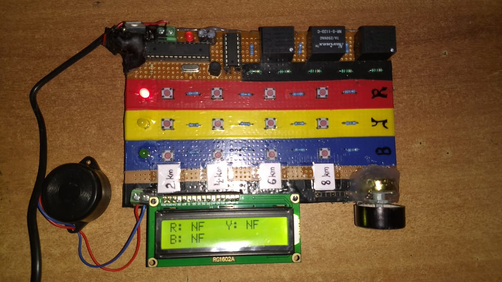

# TriPhase Cable Fault Locator

<p align="center">
  
</p>

An embedded system for detecting and locating faults in underground three-phase cables.  
By sending high-voltage pulses and measuring reflected signals, this device calculates the distance to the fault on each phase (R, Y, B), visualizes distance thresholds with LEDs, displays precise readings on an LCD, and alerts via buzzer.

---

## 🔧 Hardware Components

- **Microcontroller**: Arduino Uno (or compatible ATmega328P board)  
- **LCD Module**: 16×2 LiquidCrystal (pins: RS=12, EN=11, D4=5, D5=4, D6=3, D7=2)  
- **High-Voltage Pulse Driver**: Custom driver circuit (connect to digital pin 13)  
- **Phase Selection**: Three pushbuttons for R, Y, B phases (pins: 7, 8, 9)  
- **Fault Distance LEDs** (per phase):
  - 2 km (green), 4 km (yellow), 6 km (blue), 8 km (red)  
  - Resistors as needed (220 Ω)  
- **Buzzer / Speaker**: Tone output for audible feedback (pin 10)  
- **Power Supply**: 12 V or external supply depending on driver circuit  

---

## 📂 Repository Structure

```
.
├── src/
│   ├── TriPhase_Cable_Fault_Locator.ino  # Main firmware
│   ├── LCD.ino                           # LCD helper routines
│   └── buzzer.ino                        # Buzzer alert logic
├── hardware/
│   └── wiring_diagram.png                # Schematic and PCB layout
├── docs/
│   └── UserGuide.md                      # Detailed user manual
├── README.md                             # This file
└── LICENSE                               # MIT License
```

---

## 🚀 Quick Start

1. **Wire up the hardware**  
   - Refer to `hardware/wiring_diagram.png` for pinouts and connections.  
   - Ensure pushbuttons for phase selection are debounced and connected to GND/pull-up.

2. **Install Arduino IDE & Libraries**  
   - [Arduino IDE](https://www.arduino.cc/en/software)  
   - LiquidCrystal (built-in)

3. **Upload Firmware**  
   1. Open `src/TriPhase_Cable_Fault_Locator.ino` in Arduino IDE.  
   2. Select your board and COM port.  
   3. Click **Upload**.

4. **Power On & Test**  
   - Power the device and observe initial LED self-test and LCD startup message.  
   - Press R/Y/B button to select a phase; the buzzer will chirp, LEDs light up to indicate fault range, and LCD displays distance (e.g., `R: 3.2km`).

---

## 📝 Usage & Calibration

- **Distance Calculation**  
  - Based on time elapsed between pulse emission and echo reception.  
  - Speed factor configurable in code (default for copper ~2×10^8 m/s).

- **LED Thresholds**  
  - Default: 2 km, 4 km, 6 km, 8 km  
  - Modify `thresholds[]` array in firmware for custom ranges.

- **Buzzer Alerts**  
  - Continuous tone increases frequency over time; resets after 8 km.  
  - Helps audibly confirm measurement cycle.

- **Troubleshooting**  
  - **No Echo Detected (NF)**: LCD shows `NF` → Check pulse driver, cable connectivity, grounding.  
  - **Erratic Readings**: Verify pull-up resistors on buttons and debounce in hardware.

---

## 🎯 Customization

- **Phase Count**: Add more phases by extending `phasePins[]` and replicating LED strips.  
- **Display**: Swap to OLED or TFT by replacing LCD library calls.  
- **Data Logging**: Integrate SD card module to record timestamped fault distances.

---

## 🤝 Contributing

Pull requests, bug reports, and feature requests are welcome!  
Please follow standard Arduino code style and include comments for new functionality.

---

## 📄 License

This project is licensed under the **MIT License**. See [LICENSE](LICENSE) for details.
